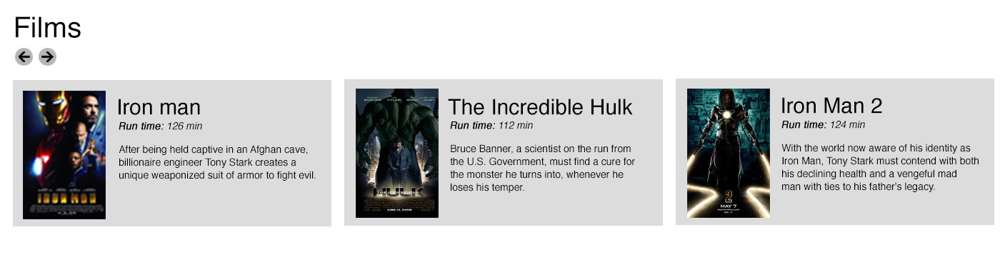

# Think Jam FED Test 2018

This repo has all the files you need for the Think Jam FED test.

Clone this repo and complete the tasks below. Please spend no longer than two hours on the test and be honest with your time. There is an optional task should you get time and fancy a challenge

Once completed, please commit to github on your own account and send a link of your repo to jonathan.wright@thinkjam.com

## Install Dependencies

The test uses a simple Gulp file for handling SCSS preprocessing so first up install the gulp Dependencies, if you need to install gulp first info can be found [here](https://gulpjs.com/)

```bash
npm install
```

once installed there is a watch task and a build task which can be run.

```bash
# watch
gulp watch

# default build
gulp
```


## Task 1
The JSON feed is broken, please fix.

## Task 2
Please create a more HTML5 friendly layout, this one has a bit of div-itis

## Task 3
Please use the provided JSON to add in the header information similar to the attached header image


## Task 4
Reorganise the JSON feed so that it matches the sample image. Left and right buttons should cycle through the films one at a time



## Optional Task
Split the films into three seperate carousels, ordered by phases.
